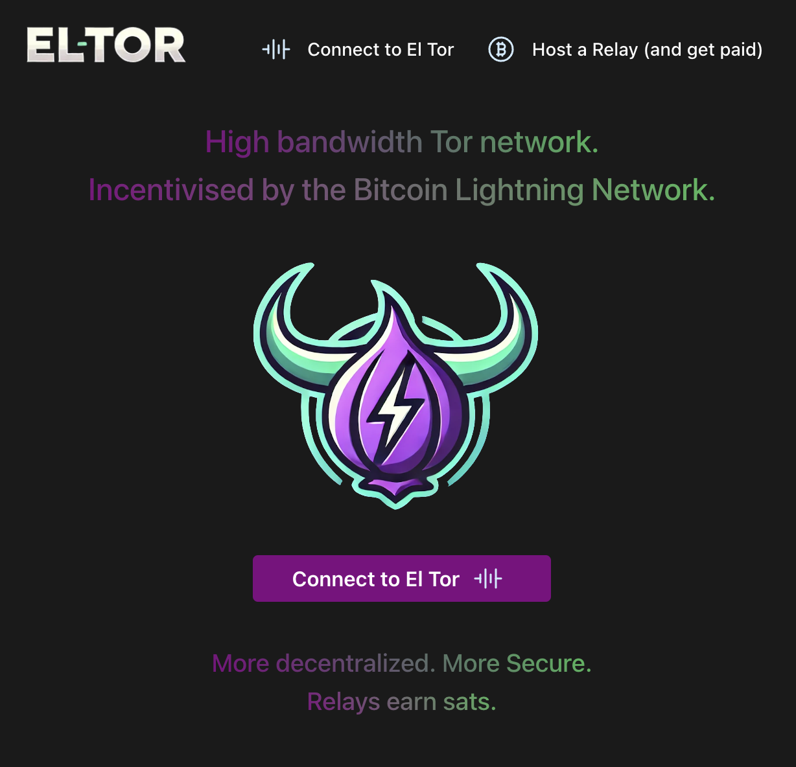
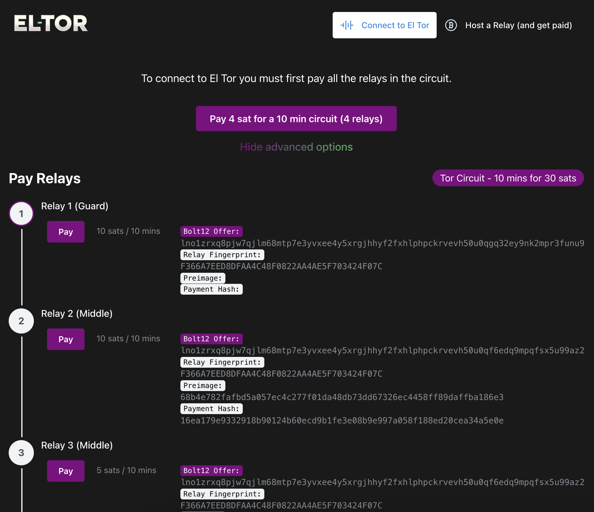
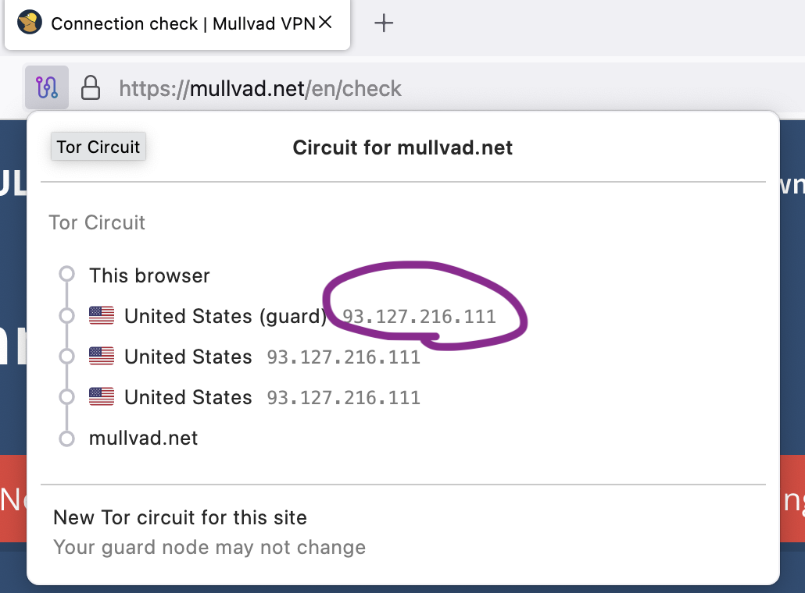

# El Tor App

This is the El Tor App that allows a user to connect to the El Tor network. It configures the Tor Browser automatically to point to the network fork by configuring the torrc file with extra BOLT 12 settings and Directory Relays. It also controls the payments like a wallet. This app can be used by a user wanting to get paid for sharing his bandwidth as a Relay. It can also be used as a user wanting to consume bandwidth from the El Tor network.  This code will be ported over to a native "tray app" similar to Wireguard or Orbot and appear in the tray of the operating system. 

<div style="max-width: 480px; height: auto;">
    
    
    
</div>

# El Tor Install

### Browser Config

To connect the `Tor Browser` to the El Tor network you need to have a drop in replacement of the `tor binary` and a custom `torrc` config file. If you
already have the Tor Browser installed on your computer you can run this script to configure it to use El Tor

**mac**
```
bash <(curl -L https://bitbucket.org/eltordev/eltor-app/raw/master/scripts/mac/install.sh)
```
uninstall
`bash <(curl -L https://bitbucket.org/eltordev/eltor-app/raw/master/scripts/mac/uninstall.sh)`

**linux**

You must have Tor-Browser installed in the directory `~/tor-browser` for this script to work.
```
bash <(curl -L https://bitbucket.org/eltordev/eltor-app/raw/master/scripts/linux/install.sh)
```
uninstall
`bash <(curl -L https://bitbucket.org/eltordev/eltor-app/raw/master/scripts/linux/uninstall.sh)`

**connectivity test**

You can check that El Tor installed properly by opening the `Tor Browser > Connect > Circuit (icon in the url bar)`

The network is small right now (only 2 relays and counting) so you should see the IP `93.127.216.111`. 
If you click "New Tor Circuit" a few times you might see a canadian ip show up as a middle relay.

<div style="max-width: 480px; height: auto;">
    
</div>

**hidden service test**

http://3zlcerfvzmmdj2zv5j2lnz32762dwukcznrimbxllve4dzbjhmxkc4id.onion

### Relay Config
This script will download the `el tor` binary and prompt you to configure the `torrc` config file.
**linux**
```
bash <(curl -L https://bitbucket.org/eltordev/eltor-app/raw/master/scripts/linux/relay.sh)
```
After the script is ran you can start your el tor relay with this command:
```
./tor -f torrc
```

**Run as Daemon**
To run as a daemon
`touch /etc/systemd/system/tor.service`
```
[Unit]
Description=ElTorRelay
After=network.target

[Service]
User=root
ExecStart=/home/root/eltor/tor -f /home/root/eltor/torrc
PIDFile=/var/run/tor/tor.pid
Restart=on-failure

[Install]
WantedBy=multi-user.target
```
- `sudo systemctl daemon-reload`
- `sudo systemctl enable tor`
- To check that tor is running `sudo apt install nyx` then `nyx -i 127.0.0.1:8061`

# Code

This is an Electron app

## Getting Started

```
pnpm i
pnpm run dev
```

## Build

```
pnpm run build:mac
```