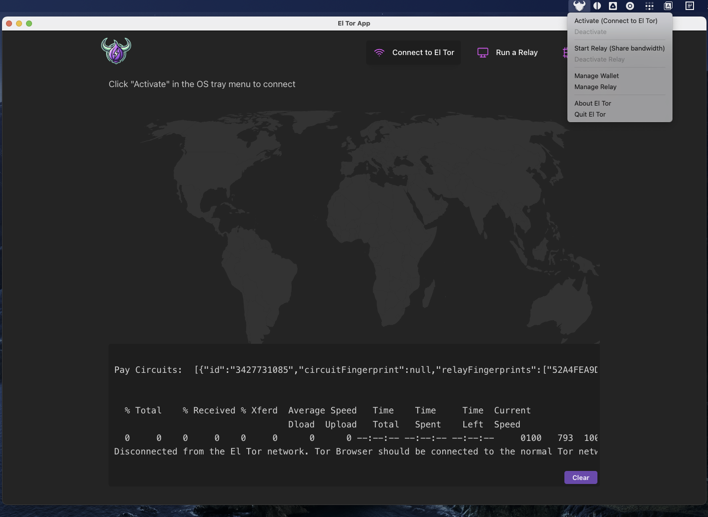

# El Tor App

A modern desktop and web application for connecting to the El Tor network - a privacy-focused network that allows users to share bandwidth as relays or consume bandwidth as clients, with built-in payment capabilities.

## 🌐 Architecture

This project supports **dual deployment modes**:

- **🖥️ Desktop App**: Native Tauri application with system tray integration
- **🌐 Web App**: Browser-based application with standalone Rust backend

```
┌─────────────────┐    ┌─────────────────┐
│   React Frontend │    │   Rust Backend  │
│                 │    │                 │
│ • UI Components │◄──►│ • Tor Control   │
│ • State Mgmt    │    │ • Eltord Mgmt   │
│ • Routing       │    │ • Process Ctrl  │
└─────────────────┘    └─────────────────┘
        │                       │
        ▼                       ▼
┌─────────────┐         ┌─────────────┐
│   Web App   │         │ Tauri App   │
│ (HTTP APIs) │         │ (IPC Calls) │
└─────────────┘         └─────────────┘
```

## 🚀 Quick Start

### Prerequisites
- **Node.js** 18+ with pnpm
- **Rust** 1.70+
- **Eltord** project at `~/code/eltord/`

### 🌐 Web Mode
```bash
# Terminal 1: Start Rust backend
cd backend
cargo run

# Terminal 2: Start React frontend
cd frontend
pnpm dev:web
```
Open http://localhost:5173

### 🖥️ Desktop Mode
```bash
cd frontend
pnpm dev:tauri
```

## 📁 Project Structure

```
eltor-app/
├── frontend/              # React Frontend (Vite + Tauri)
│   ├── src/
│   │   ├── components/    # UI Components
│   │   ├── services/      # API abstraction layer
│   │   ├── utils/         # Platform detection
│   │   └── hooks/         # Custom React hooks
│   ├── src-tauri/         # Tauri desktop app
│   └── package.json
├── backend/               # Standalone Rust server
│   ├── src/
│   │   └── main.rs        # HTTP API server
│   └── Cargo.toml
└── README.md
```

## 🔧 Features

### Core Functionality
- **Tor Network Control**: Connect/disconnect from Tor
- **Eltord Process Management**: Start/stop eltord client processes
- **Dual Mode Support**: Web browser OR native desktop app
- **System Tray Integration**: (Desktop mode only)
- **Real-time Status Updates**: Process monitoring and notifications

### Platform Detection
The app automatically detects whether it's running in web or desktop mode and uses the appropriate API layer:
- **Desktop**: Direct IPC calls to embedded Rust backend
- **Web**: HTTP requests to standalone Rust server

## 🛠️ Development

### Available Scripts

```bash
# Quick start
npm i
npm run tauri     # quick start to run the tauri app with rust invoke backend
npm run web       # quick start to run web frontend with rust rest backend

# Frontend
cd frontend
pnpm dev:web      # Web development mode  
pnpm dev:tauri    # Desktop development mode

# Backend
cd backend
cargo build       # Build binary
cargo run         # Start HTTP server

# Docker
npm run docker
```

### Environment Setup

**Web Development:**
- Frontend runs on `http://localhost:5173`
- Backend API on `http://localhost:5174`
- Supports hot reload for both frontend and backend

**Desktop Development:**
- Single command starts both frontend and embedded backend
- System tray integration with menu controls
- Native file system access

## 📦 Building for Production

### Web App
```bash
# Build frontend
cd frontend && pnpm build:web

# Build backend
cd backend && cargo build --release

# Deploy frontend to static hosting (Vercel, Netlify)
# Deploy backend to cloud service (Railway, Fly.io)
```

### Desktop App
```bash
cd frontend
pnpm build:tauri
```

Outputs platform-specific installers:
- **Windows**: `.msi`, `.exe`
- **macOS**: `.dmg`, `.app`
- **Linux**: `.deb`, `.rpm`, `.AppImage`

## 🌐 El Tor Network

### Browser Configuration

Configure Tor Browser to use the El Tor network:

**macOS:**
```bash
curl -L https://bitbucket.org/eltordev/eltor-app/raw/master/scripts/mac/install.sh | bash
```

**Linux:**
```bash
curl -L https://bitbucket.org/eltordev/eltor-app/raw/master/scripts/linux/install.sh | bash
```

### Network Testing

**Connectivity Check:**
1. Open Tor Browser
2. Navigate to Circuit info (lock icon in URL bar)
3. Look for IP `170.75.160.21` in the circuit

**Hidden Service Test:**
```
http://3zlcerfvzmmdj2zv5j2lnz32762dwukcznrimbxllve4dzbjhmxkc4id.onion
```

### Running as Relay

**Linux Relay Setup:**
```bash
curl -L https://bitbucket.org/eltordev/eltor-app/raw/master/scripts/linux/relay.sh | bash
```

**Start Relay:**
```bash
./tor -f torrc
```

**Run as Systemd Service:**
```bash
sudo tee /etc/systemd/system/tor.service << EOF
[Unit]
Description=ElTorRelay
After=network.target

[Service]
User=root
ExecStart=/home/root/eltor/tor -f /home/root/eltor/torrc
PIDFile=/var/run/tor/tor.pid
Restart=on-failure

[Install]
WantedBy=multi-user.target
EOF

sudo systemctl daemon-reload
sudo systemctl enable tor
sudo systemctl start tor
```

**Monitor Relay:**
```bash
sudo apt install nyx
nyx -i 127.0.0.1:8061
```

## 🔒 Security & Privacy

- **No data collection**: All processing happens locally
- **Tor integration**: Built-in privacy protection
- **Process isolation**: Eltord runs in separate processes
- **System tray**: Minimal UI footprint

## 🤝 Contributing

1. Fork the repository
2. Create a feature branch
3. Make your changes
4. Test in both web and desktop modes
5. Submit a pull request

## 📜 License

MIT License - see LICENSE file for details

## 🖼️ Screenshots

<div align="center">
  
  
  
  
</div>

---

**El Tor**: Privacy-first networking with economic incentives 🚀

Umbrel
=======

To copy local phoenix conf folder over to umbrel via ssh for testing:
```
scp ~/.phoenix/* umbrel@umbrel.local:~/umbrel/app-data/eltor-app/data/phoenix
```