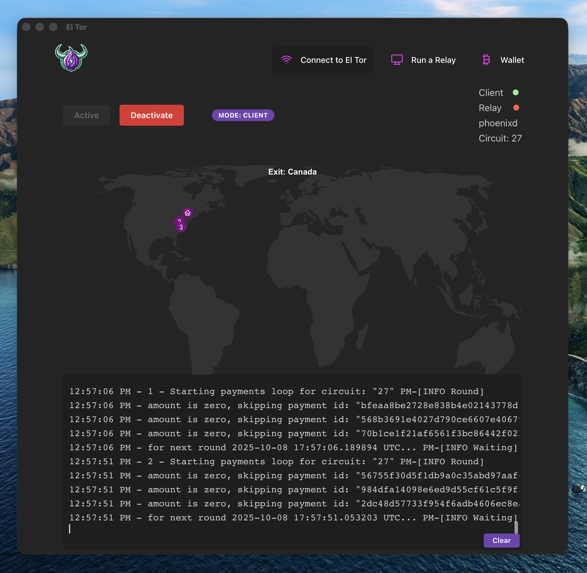
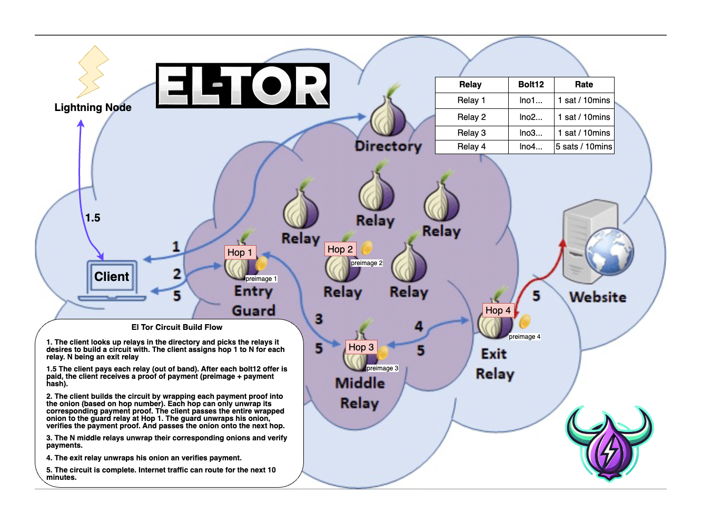

# El Tor App

A modern VPN-like desktop and web app for connecting to the El Tor network - a privacy-focused network (Tor fork) that allows users to share bandwidth, as relays, or consume bandwidth as clients. Built-in payment capabilities using Lightning.


## 🚀 Quick Start
### Prerequisites
- **Node.js** 18+ with pnpm
- **Rust** 1.70+
- **eltord** project at `~/code/eltord/`
- setup [env vars](#environment-setup)

todo: nix
### 🌐 Web Mode
```bash
npm run web
# Frontend runs on `http://localhost:5173` (with vite proxy to backend at /api)
# Backend API on `http://localhost:5174`
```
Open http://localhost:5173
### 🖥️ Desktop Mode
```bash
npm run tauri
```


## 🌐 Architecture

This project supports **dual deployment modes**:

- **🖥️ Desktop App**: Native Tauri application with system tray integration
- **🌐 Web App**: Browser-based application with standalone Rust backend

```
┌─────────────────┐    ┌─────────────────┐
│  React Frontend │    │   Rust Backend  │
│                 │    │                 │
│ • UI Components │◄──►│ • Tor Control   │
│ • State Mgmt    │    │ • eltord mgmt   │
│ • Routing       │    │ • Process Ctrl  │
└─────────────────┘    └─────────────────┘
        │                       │
        ▼                       ▼
┌─────────────┐         ┌─────────────┐
│   Web App   │         │ Tauri App   │
│ (HTTP APIs) │         │ (IPC Calls) │
└─────────────┘         └─────────────┘
```


## 📁 Project Structure
```
eltor-app/
├── frontend/              # React Frontend (Vite + Tauri)
│   ├── src/
│   │   ├── components/    # UI Components
│   │   ├── services/      # API abstraction layer
│   │   ├── utils/         # Platform detection
│   │   └── hooks/         # Custom React hooks
│   ├── src-tauri/         # Tauri desktop app
│   └── package.json
├── backend/               # Standalone Rust server
│   ├── src/
│   │   └── main.rs        # HTTP API server
│   └── Cargo.toml
└── README.md
```


## 🛠️ Development
### Available Scripts

```bash
# Quick start
npm i
npm run tauri     # quick start to run the tauri app with rust invoke backend
npm run web       # quick start to run web frontend with rust rest backend

# Frontend
cd frontend
pnpm dev:web      # Web development mode  
pnpm dev:tauri    # Desktop development mode
pnpm build:web    # Bundle prod dist web
pnpm build:tauri  # Bundle tauri app

# Backend
cd backend
cargo build             # Build debug
cargo build --release   # Build release target 
cargo run               # Start HTTP server. Alternative command ./run.sh

# Docker
npm run docker # to run locally
# package - remember to increment the version in package.json and cargo.toml
npm run docker:build:arm
npm run docker:build:amd
npm run docker:push
npm run docker:manifest
```

### Environment Setup
Copy `.env.example` to `.env` and configure:

```bash
cp .env.example .env
# Edit .env with your configuration
```
**Key Environment Variables:**
```
BIND_ADDRESS="127.0.0.1"
BACKEND_PORT="5174"
APP_ELTOR_USE_PHOENIXD_EMBEDDED="false"
APP_ELTOR_LN_IMPLEMENTATION="cln"
APP_ELTOR_LN_CONFIG="type=cln url=https://YOURURL:PORT rune=YOUR_RUNE default=true"
APP_ELTOR_LN_BOLT12="lno***"
APP_ELTOR_USER_DIR="$PWD"
APP_ELTOR_ELTORRC_PATH="$PWD/backend/bin/data"
ACCEPT_INVALID_CERTS=true
```


## 📦 Release (CI)

Outputs platform-specific installers:
- **Windows**: `.msi`, `.exe`
- **macOS**: `.dmg`, `.app`
- **Linux**: `.deb`, `.rpm`, `.AppImage`

#### arm64 Docker Builds
Arm builds on Github is super slow, instead of using Github actions, you can use "act" https://nektosact.com/ to locally build arm64 based images. This allows you to build locally on a Mac M-series and still push artifacts to Github.

1. Install Prereqs
  ```
  docker buildx create --name mybuilder --driver docker-container --use 
  docker buildx inspect --bootstrap 
  docker run --privileged --rm tonistiigi/binfmt --install all
  # if you use orbstack and get errors you might need to turn off (or on?) rosetta 
  orb config set rosetta false

  brew install act
  docker info | grep Architecture
  ```

2. Create ./secrets
  ```
  GITHUB_TOKEN=ghp_yourtokenhere
  DOCKER_USERNAME=yourdockerusername
  DOCKER_PASSWORD=dckr_pat_yourtokenhere
  ```
3. Run a actions build locally
```
npm run actions
# or
act push --secret-file .secrets --matrix platform:linux/arm64 -j build-docker-arm -P macos-latest=catthehacker/ubuntu:act-latest
```


## 🔧 Features
### Core Functionality
- **Tor Network Control**: Connect/disconnect from Tor
- **Eltord Process Management**: Start/stop eltord client processes
- **Dual Mode Support**: Web browser OR native desktop app
- **System Tray Integration**: (Desktop mode only)
- **Real-time Status Updates**: Process monitoring and notifications
### Platform Detection
The app automatically detects whether it's running in web or desktop mode and uses the appropriate API layer:
- **Desktop**: Direct IPC calls to embedded Rust backend
- **Web**: HTTP requests to standalone Rust server


## Umbrel
Community App Store
https://github.com/el-tor/eltor-store


## 🖼️ Screenshots
<div align="center">
  <br/>
  
</div>


## 📜 License
MIT License